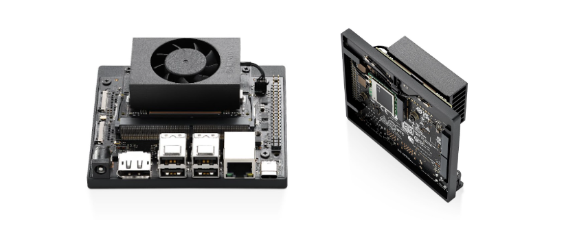

---
hide:
  - footer
---

# Onboard Computer

In a second iteration of the vehicle, the onboard computer was switched to an [**NVIDIA Jetson Orin Nano**](https://developer.nvidia.com/embedded/learn/get-started-jetson-orin-nano-devkit) which already comes with its own carrier board (developed by *NVIDIA*). The specific model used is the **8GB Developer Kit** version. Besides switching to a newer version of the board (Orin vs Xavier), the **Orin Nano** also includes some GPIO pins which can be used to directly connect to the flight computer without the need for an FTDI adaptor.

