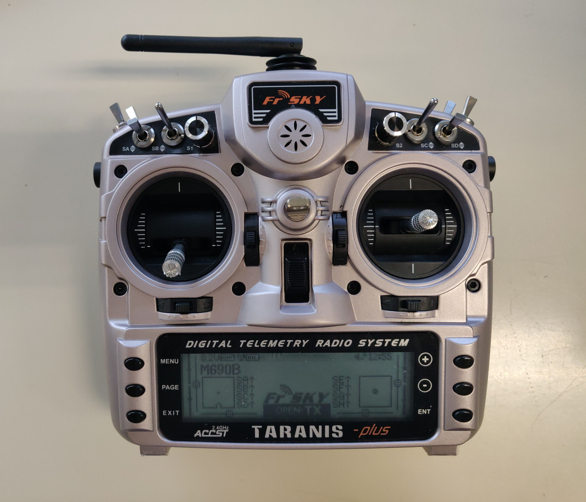

---
hide:
  - footer
---

# Radio and Receiver

## Radio

The radio used is the [Taranis X9D Plus](https://www.frsky-rc.com/product/taranis-x9d-plus-2/). The transmitter was binded to the receiver according to the instructions provided by the receiver manufactor and a new model for the **M690B** was created on the transmitter. The inputs and channel mixer were mapped as following.

| INPUTS      | Mapping | MIXER | Description |
| ----------- | ------- | ----- | ----------- |
| Thr         | Thr     | CH1   | Engine      |
| Ail         | Ail     | CH2   | Roll        |
| Ele         | Ele     | CH3   | Pitch       |
| Rud         | Rud     | CH4   | Yaw         |
| FMod        | SE      | CH5   | Flight Mode |
| Offb        | SB      | CH6   | Offboard    |
| Kill        | SC      | CH7   | Kill SW     |
| ARM         | SD      | CH8   | ARM SW      |

## Receiver

The receiver used is the [FrSky X8R](https://www.frsky-rc.com/product/x8r/) which is connected to the flight computer using the SBUS connection. Instructions to bind the receiver with the transmitter can be found [here](https://www.frsky-rc.com/wp-content/uploads/2017/07/Manual/X8R.pdf).