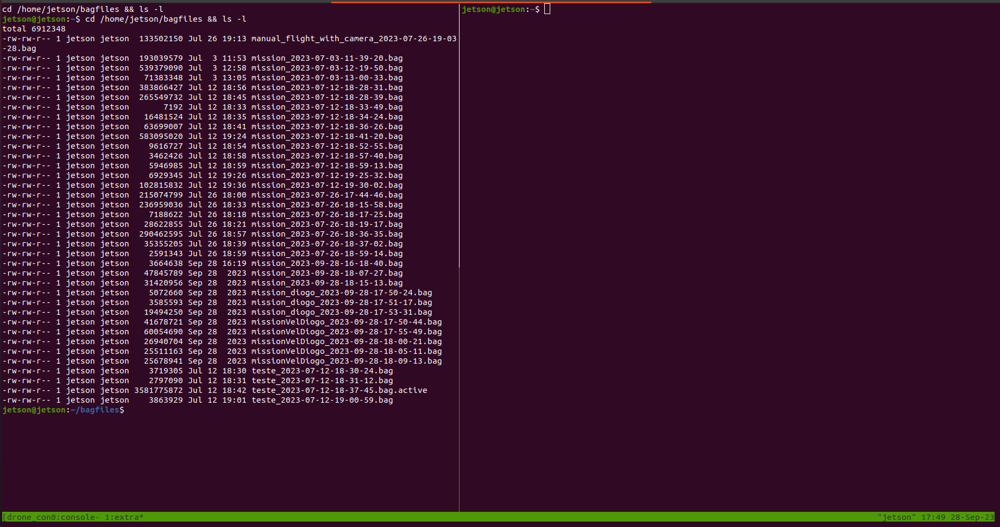

---
hide:
  - footer
---
# Drone Console

This section describes the console created to facilitate the process of monitoring the vehicle and running offboard algorithms during real trials. It contains several features like battery monitoring and access to the PX4 via mavros.

## Installation

The files required for the drone console include the **mav_tools** ROS package as well as a couple of scripts which can be found [here](https://github.com/hardtekpt/M690B-Wiki/tree/master/drone_console). The scripts folder should be placed in the home folder and the **mav_tools** package should be placed in the catkin workspace.

!!! note

    To run the `drone_console.bash` when the drone boots, add this to your crontab (`crontab -e`): `@reboot /home/jetson/scripts/drone_console.bash`

## Usage

To open the **drone console** start by login in into the drone. To make it easier, add this to your `bashrc`:

'''bash
alias drone_console='tmux a -t drone_console'
'''

In this way, the console can be accessed using the `drone_console` command.

## Demo

In the main window, there are four panels. In the top left is the **mav_tools** ros package, which allows easy monitoring and basic control of the vehicle. In the bottom left, mavros is running, so that a connection to the PX4 is always available via ROS. In the top right, a terminal is available for running the offboard algorithms. Finally, in the bottom right a terminal has the `drone_bringup.launch` file open so that the mission to be ran can be configured.

In the second window a panel shows the recorded rosbag files and a second panel provides an auxiliary terminal.

