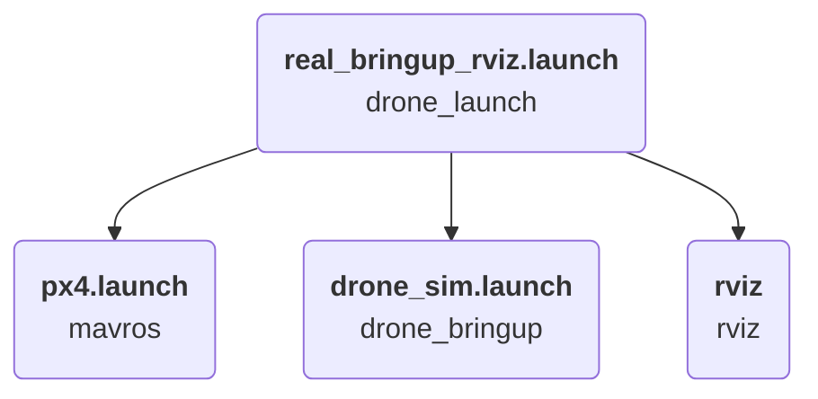

---
hide:
  - footer
---
# Drone Control Stack Setup

This section describes the steps followed to install the drone control stack on the onboard computer. This stack is composed of ROS packages which allow the vehicle to be controlled from ROS nodes using the available cpp UAV class. It should be noted that the steps described include everything that is needed to run simulations in adition to controlling the real drone.

## Environment Setup

Before installing the ROS packages, it is necessary to create a workspace and install the PX4 firmware (only used for simulations).

-   Creating a catkin workspace
    ```bash
    mkdir ~/uav/uav_ws/src
    cd ~/uav/uav_ws
    catkin_make
    ```

-   Installing the PX4 firmware
    ```bash
    cd ~/uav
    git clone --recursive https://github.com/PX4/PX4-Autopilot.git
    cd PX4-Autopilot
    git fetch --all --tags
    git checkout v1.12.3 -b latest
    git submodule update --init --recursive
    make px4_sitl gazebo
    ```

!!! note

    While installing the PX4 firmware, some missing packages might need to be installed with pip. If pip is not available it can be installed with `sudo apt install python3-pip`.

-   In order not to pollute the `bashrc` profile, a script was created to load the needed environment variables
    ```bash
    cd ~/uav
    touch setup.bash
    ```

-   Contents of the `setup.bash` file
    ```bash
    source ~/uav/uav_ws/devel/setup.bash

    export CATKIN_WORKSPACE=~/uav/uav_ws

    export GAZEBO_PLUGIN_PATH=$GAZEBO_PLUGIN_PATH:/home/jetson/uav/PX4-Autopilot/build_gazebo
    export GAZEBO_MODEL_PATH=$GAZEBO_MODEL_PATH:/home/jetson/uav/PX4-Autopilot/Tools/sitl_gazebo/models

    export LD_LIBRARY_PATH=$LD_LIBRARY_PATH:/home/jetson/uav/PX4-Autopilot/build_gazebo
    export ROS_PACKAGE_PATH=$ROS_PACKAGE_PATH:/home/jetson/uav/PX4-Autopilot:/home/jetson/uav/PX4-Autopilot/Tools/sitl_gazebo

    source /home/jetson/uav/PX4-Autopilot/Tools/setup_gazebo.bash /home/jetson/uav/PX4-Autopilot /home/jetson/uav/PX4-Autopilot/build/px4_sitl_default
    ```

## Control Stack Overview

Now that the environment is prepared, the code stack can be installed inside the created workspace. Below is a tree view of all the packages included in the stack. The packages listed here are available in [this repository](https://github.com/hardtekpt/M690B-Wiki/tree/master/drone_control_stack/src).

```bash
src/
├── drone_bringup
├── drone_gazebo
│   ├── drone_description
│   └── drone_worlds
├── drone_launch
└── drone_library
    ├── drone_gimmicks_library
    ├── drone_utils_cpp
    └── mavros_cpp
```

### Simulation flow

``` mermaid
graph TD
  A(<b>simulator_bringup.launch</b> <br> drone_launch) --> B(<b>vehicle_bringup.launch</b> <br> drone_launch);
  A --> C(<b>empty_world.launch</b> <br> gazebo_ros);
  A -. simulator_bringup_rviz.launch .-> G(<b>rviz</b> <br> rviz);
  B --> D(<b>single_vehicle_spawn.launch</b> <br> drone_launch);
  B --> E(<b>px4.launch</b> <br> mavros);
  B --> F(<b>drone_sim.launch</b> <br> drone_bringup);
```

### Real mission flow



## ROS Packages Overview

### drone_bringup

The `drone_sim.launch` file loads the vehicle and main algorithm parameters and calls the ROS node that has the mission to be carried out.

```bash
src/drone_bringup/
├── CMakeLists.txt
├── config
│   └── simulation
│       └── iris
│           └── config.yaml
├── launch
│   └── drone_sim.launch
└── package.xml
```

### drone_description

The `drone_description` package contains the **Gazebo** models for the vehicles used.

```bash
src/drone_gazebo/drone_description/
├── CMakeLists.txt
├── models
│   └── iris
│       ├── iris.sdf.jinja
│       ├── iris.urdf
│       ├── meshes
│       │   ├── iris_prop_ccw.dae
│       │   ├── iris_prop_cw.dae
│       │   └── iris.stl
│       └── model.config
├── package.xml
└── scripts
    ├── jinja_gen.py
    ├── names.py
    ├── schema_download.bash
    ├── substitution_args.py
    └── validate_sdf.bash
```

### drone_worlds

The `drone_worlds` package contains the world files that can be used during simulations in **Gzaebo**.

```bash
src/drone_gazebo/drone_worlds/
├── CMakeLists.txt
├── package.xml
└── worlds
    ├── baylands.world
    ├── boat.world
    ├── empty.world
    ├── hippocampus.world
    ├── hitl_iris.world
    ├── hitl_standard_vtol.world
    ├── iris_irlock.world
    ├── ksql_airport.world
    ├── mcmillan_airfield.world
    ├── ocean.world
    ├── sonoma_raceway.world
    ├── typhoon_h480.world
    ├── uuv_bluerov2_heavy.world
    ├── uuv_hippocampus.world
    ├── warehouse.world
    ├── windy.world
    └── yosemite.world
```

### drone_launch

The `drone_launch` package contains several launch files that are used to run simulations and to run missions with the real drone.

```bash
src/drone_launch/
├── CMakeLists.txt
├── launch
│   ├── real_bringup_rviz.launch
│   ├── rvizcfg.rviz
│   ├── simulator_bringup.launch
│   ├── simulator_bringup_rviz.launch
│   ├── single_vehicle_spawn.launch
│   └── vehicle_bringup.launch
└── package.xml
```

### drone_gimmicks_library

The `drone_gimmicks_library` package contains some useful macros to reduce the complexity of some common ROS operations like getting parameters.

```bash
src/drone_library/drone_gimmicks_library/
├── CMakeLists.txt
├── include
│   └── drone_gimmicks_library
│       └── DroneGimmicks.h
├── package.xml
└── src
    └── DroneGimmicks.cpp
```

### drone_utils_cpp

The `drone_utils_cpp` package contains some useful functions while working with drones, like converting between different coordinate frames and normalizing thrust values.

```bash
src/drone_library/drone_utils_cpp/
├── CMakeLists.txt
├── doc
│   └── README.md
├── include
│   └── drone_utils_cpp
│       ├── DroneInfo.h
│       ├── DroneStatus.h
│       └── Utils.h
├── package.xml
└── src
    └── Utils.cpp
```

### mavros_cpp

The `mavros_cpp` package contains the main class (*UAV*) which is used to control the drone as well as to get telemetry data.

```bash
src/drone_library/mavros_cpp/
├── CMakeLists.txt
├── doc
│   └── README.md
├── include
│   └── mavros_cpp
│       ├── Actuators.h
│       ├── EKF.h
│       ├── Sensors.h
│       └── UAV.h
├── package.xml
└── src
    ├── offboard.cpp
    ├── telemetry.cpp
    └── UAV.cpp
```

## Simulation example

After installing the code stack the provided *lissajous* example package can be executed in simulation. The `drone_sim.launch` file in the `drone_bringup` package should contain a call to the `lissajous` ROS node like so - `<node pkg="lissajous" type="lissajous_node" name="lissajous" respawn="false" output="screen"/>`.

1.  Build the workspace
    ```bash
    cd ~/uav/uav_ws
    catkin_make
    ```

2.  Source the provided bash script
    ```bash
    cd ~/uav
    source setup.bash
    ```

3.  Run the simulation
    ```bash
    roslaunch drone_launch simulator_bringup.launch
    ```

    